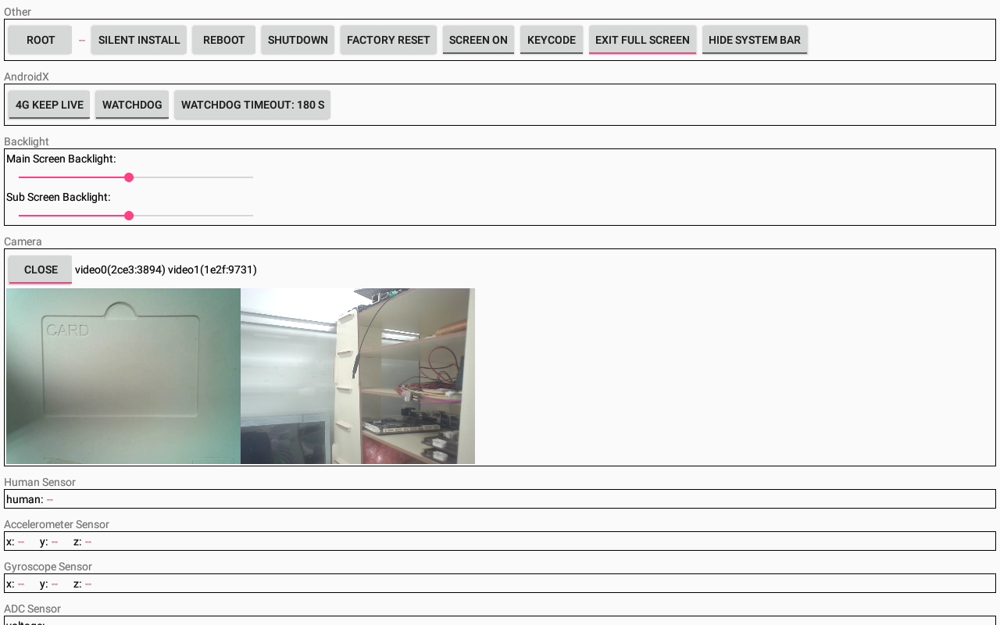
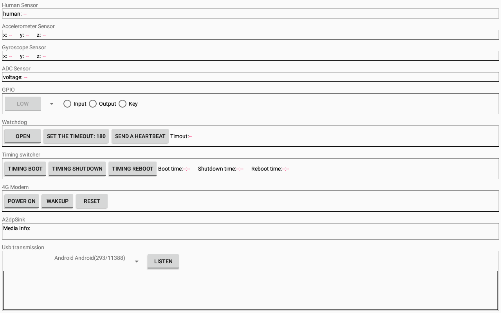

# Topband Sample

This sample is used for verification of the topband Android custom feature and includes the following features:
- Root
- Reboot/Shutdown
- Silent install
- Factory reset
- Screen on/off
- Key
- Full screen
- Hide/show system bar
- Camera
- 4G keep live(AndroidX)
- Watchdog(AndroidX)
- Human sensor
- Accelerometer sensor
- Gyroscope sensor
- Adc sensor-><https://github.com/aystshen/Android-AdcSensor>
- Gpio-><https://github.com/aystshen/Android-GPIOControlDriver>
- Watchdog->-><https://github.com/aystshen/Android-TimedBootDriver>
- Power on/off by alarm-><https://github.com/aystshen/Android-TimedBootDriver>
- 4G modem power on/off, wakeup/sleep, reset
- A2dp sink
- Usb transmission

## Preview
   
 

## Developed By
* ayst.shen@foxmail.com

## License
	Copyright(c) 2018 Habo Shen <ayst.shen@foxmail.com>

	Licensed under the Apache License, Version 2.0 (the "License");
	you may not use this file except in compliance with the License.
	You may obtain a copy of the License at

	http://www.apache.org/licenses/LICENSE-2.0

	Unless required by applicable law or agreed to in writing, software
	distributed under the License is distributed on an "AS IS" BASIS,
	WITHOUT WARRANTIES OR CONDITIONS OF ANY KIND, either express or implied.
	See the License for the specific language governing permissions and
	limitations under the License.
